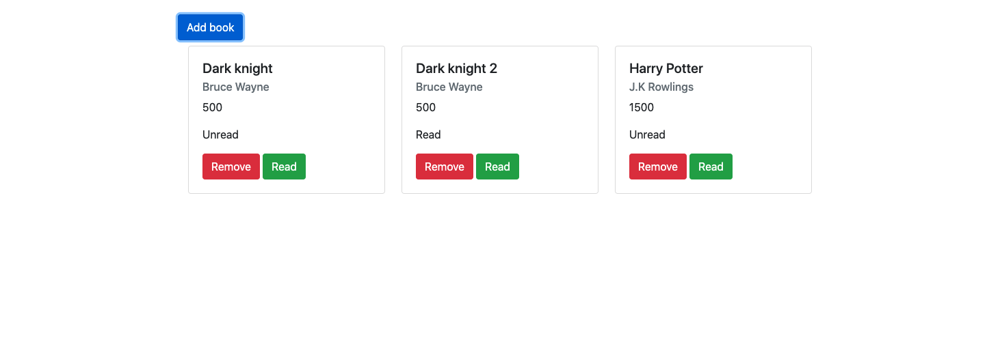

# Library

> This project is a simple mock-up of a library where we can add a new book and delete it too. While adding a new book, we are presented with a form where we can input the details of the book including title of the book, author, number of pages and the read status of book.

## Built With
- JavaScript
- HTML 5 and CSS 3.
- Bootstrap

## Live Demo

[Live Demo Link](https://dipeshtwis.github.io/Library/ )

## Getting Started

Just fork it and you are good to go.

## Authors

👤 **Akshat Sethi**

- Github: [iam-Akshat](https://github.com/iam-Akshat)
- Twitter: [Akshat Sethi](https://twitter.com/akshatsethi)
- LinkedIn: [Akshat Sethi](https://linkedin.com/in/akshatsethi)

👤 **Ahmad Chata** 
- Github: [@ahmadchata](https://github.com/ahmadchata) 
- Twitter: [@ahmadchata](https://twitter.com/ahmadchata) 
- Linkedin: [Ahmad Chata](https://www.linkedin.com/in/ahmadchata/)

## 🤝 Contributing

Contributions, issues and feature requests are welcome!

Feel free to check the [issues page](https://github.com/ahmadchata/library/issues).

## Show your support

Give a ⭐️ if you like this project!

## Acknowledgments

- [The Odin Project](https://www.theodinproject.com/courses/javascript/lessons/library)

## 📝 License

This project is [MIT](./LICENSE) licensed